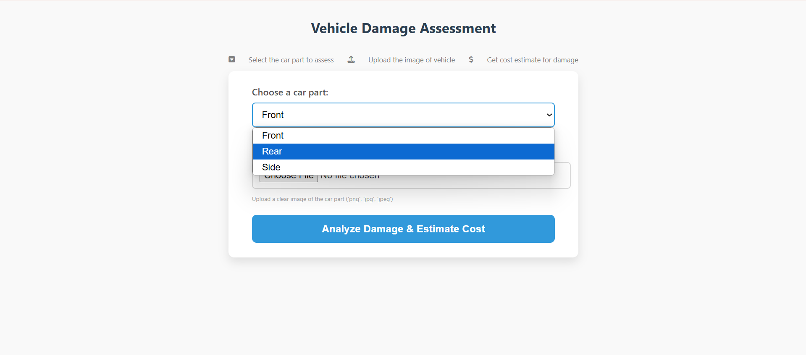
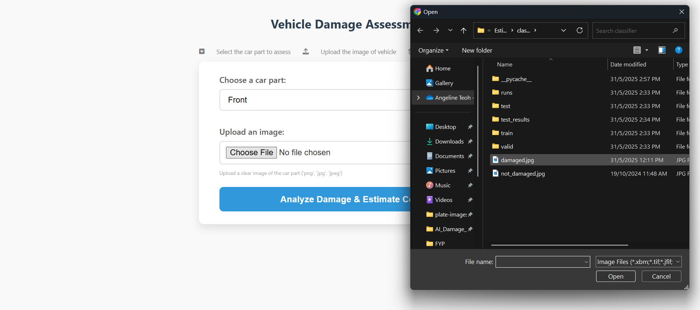
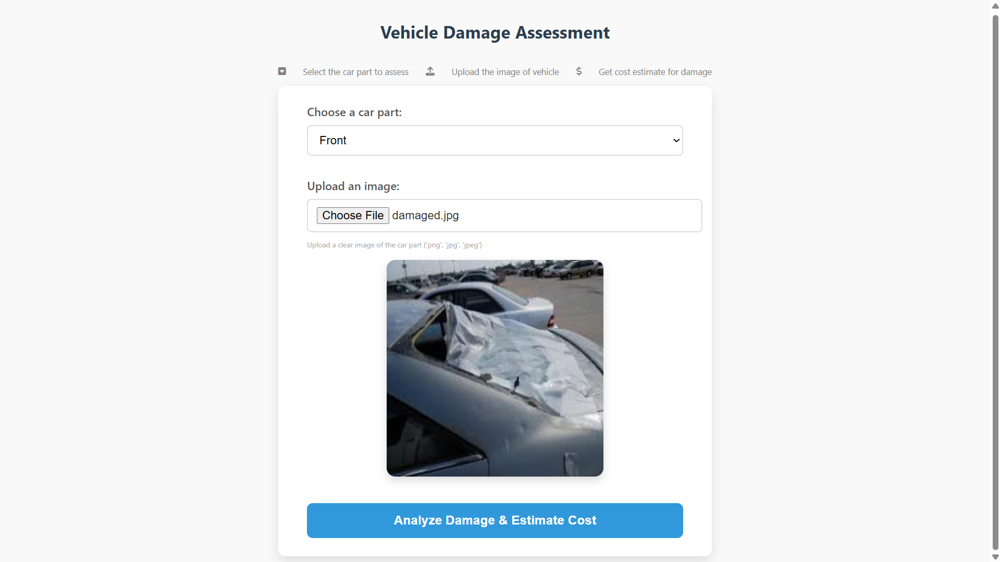
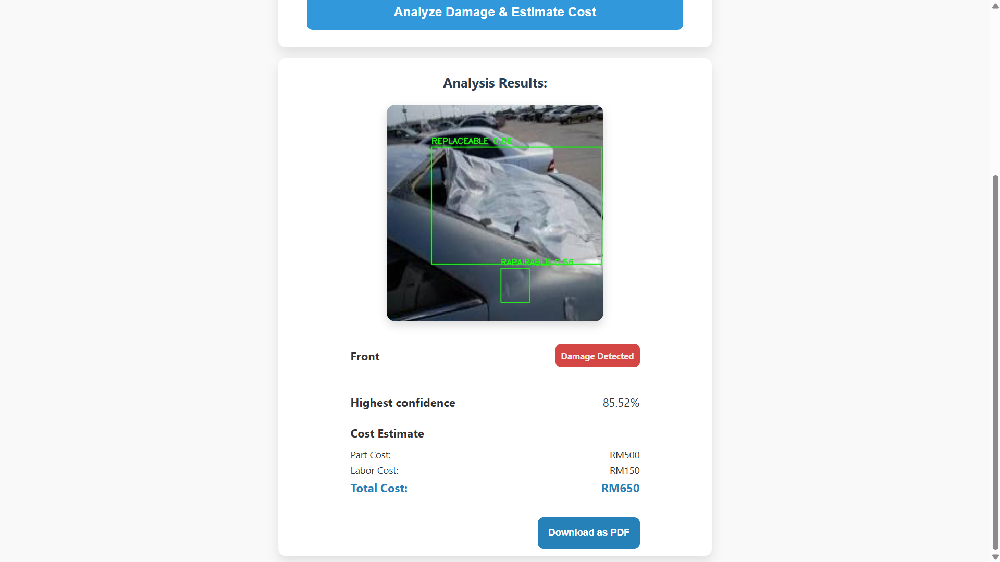
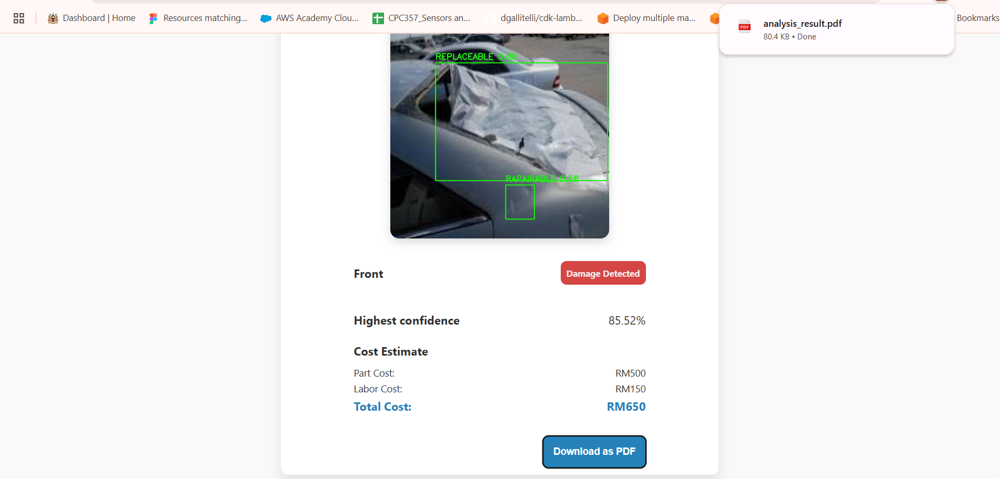
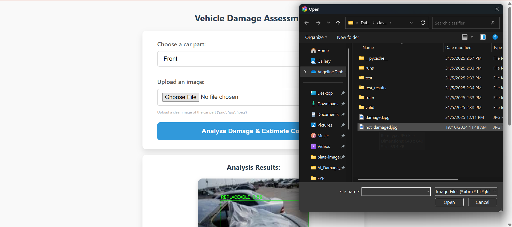
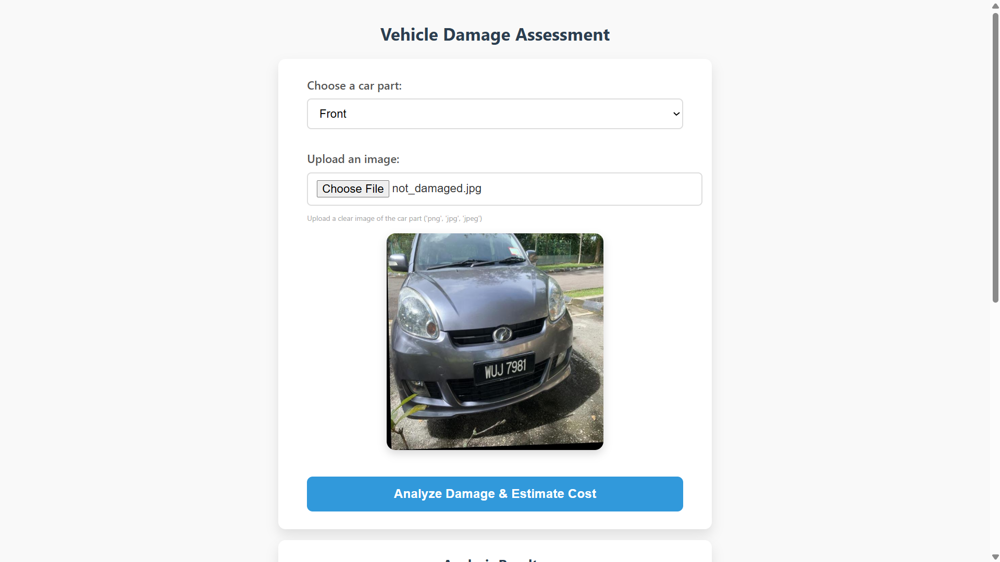
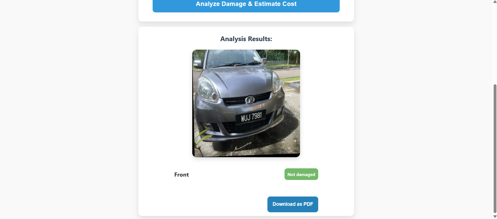

# Vehicle Damage Detection and Cost Estimation System

This web-based application allows users to upload a photo of a damaged vehicle, automatically detects any visible damage using a trained YOLO model, and estimates the repair cost based on the detected damage.

## Features

- Upload vehicle damage photos
- Detect visible damage using a YOLOv8 model
- Highlight damaged areas with bounding boxes
- Display highest confidence score
- Show part cost, labor cost, and total repair estimate
- Download analysis results as a PDF

## Project Structure
root
- app.py (flask server backend)
- predict.py (prediction function with trained YOLOv8)
- classfier (YOLOv8)
  -  data.yaml (dataset configuration)
  -  train/ (dataset for training)
  -  valid/ (dataset for validation)
  -  test/ (dataset for test)
  -  train.py (script to train YOLOv8 with train dataset)
  -  test.py (test script, output written into test_results/)
- static
  -  templates
    -  index.html
  -  css
    -  style.css
  -  prediction_out (store annotated output image from YOLOv8)

## Running the app
`python app.py`
Visit http://127.0.0.1:5000 in your browser.

## Instructions
1. Select vehicle angles

2. Upload a clear image of the car part (accepted file extensions: 'png', 'jpg, 'jpeg')

3. Preview the image selected and click on the button to analyze damage and estimate cost

4. Scroll down to view the analysis results

5. Click the download button to download the result as PDF

6. Upload another image to analyze a new image

